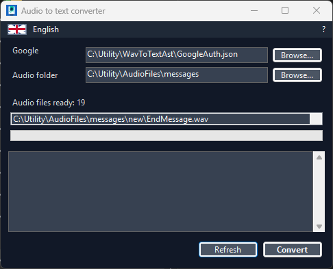
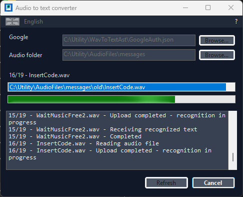

# WavToTextAsr

[](https://dotnet.microsoft.com/)
[](https://github.com/lmerega/WavToTextAsr/releases)
[](LICENSE)

WavToTextAsr is a Windows desktop tool that converts audio files into text files using Google Cloud Speech-to-Text.

It provides a small form where the user can choose the interface language, select the Google credentials JSON file, select the folder that contains the audio files, review the files found, read the instructions, and start the conversion.

The application is built for **Windows 64-bit only**. The project targets `win-x64`, so the published executable is intended for 64-bit Windows machines.

## Screenshots





## Quick Start

1. Publish or copy `WavToGoogleAsr.exe` into a working folder.
2. Double-click `WavToGoogleAsr.exe`.
3. Choose the language from the selector at the top right.
4. Select the Google service account `.json` credentials file.
5. Select the folder that contains the audio files.
6. Check the file list and click **Convert**.

The credentials file and the audio folder can be anywhere on the computer. The application remembers the last paths used.

The old folder-based layout still works as a convenient default when nothing has been selected yet:

```text
WavToGoogleAsr.exe
<your Google credentials>.json
wavfiles\
  call-001.wav
  meeting.mp3
  archive\
    message.m4a
```

If the program finds more than one `.json` file, it automatically uses the one that contains valid Google service account credentials.

The application remembers the last selected language, theme, credentials file, and audio folder in the user's AppData folder.

## Supported Audio Files

```text
.wav .mp3 .mp4 .m4a .flac .ogg .webm .aac .wma
```

For each audio file, the program creates a `.txt` file in the same folder.

It also creates a global summary file next to the executable. The file name includes the date and time of the conversion so that each run produces a separate file:

```text
Transcriptions_2026-05-29_14-30-00.txt
```

If there are no audio files to convert, the form stays open and shows the message in the log area.

## Google Credentials

You need a Google Cloud project with Speech-to-Text enabled and a service account key in JSON format.

Official Google documentation:

- Speech-to-Text authentication: https://docs.cloud.google.com/speech-to-text/docs/authentication
- Speech-to-Text IAM roles: https://docs.cloud.google.com/speech-to-text/v2/docs/iam
- Speech-to-Text role list: https://docs.cloud.google.com/iam/docs/roles-permissions/speech

### 1. Create Or Select A Google Cloud Project

1. Open https://console.cloud.google.com/
2. Use the project selector at the top of the page.
3. Create a new project or select an existing project.
4. Enable billing if Google requires it for the project.

### 2. Enable Speech-to-Text

1. Open **APIs & Services**.
2. Open **Library**.
3. Search for **Cloud Speech-to-Text API**.
4. Open it and click **Enable**.

### 3. Create A Service Account

1. Open **IAM & Admin**.
2. Open **Service Accounts**.
3. Click **Create service account**.
4. Use a clear name, for example `wav-to-text-asr`.
5. Assign a role that can use Speech-to-Text.
6. A practical choice is **Cloud Speech Client** when available in your project.
7. Finish creating the service account.

### 4. Download The JSON Key

1. Open the service account.
2. Open the **Keys** tab.
3. Click **Add key**.
4. Choose **Create new key**.
5. Select **JSON**.
6. Download the file.
7. Put the `.json` file next to `WavToGoogleAsr.exe`.

The program reads the Google project id from this JSON file automatically.

Never commit or share the Google credentials JSON file.

## Language

The program chooses the interface language from the operating system by default.

Supported interface languages:

| Code | Language |
| --- | --- |
| `ar` | Arabic |
| `de` | German |
| `en` | English |
| `es` | Spanish |
| `fr` | French |
| `hi` | Hindi |
| `it` | Italian |
| `ja` | Japanese |
| `ko` | Korean |
| `nl` | Dutch |
| `pl` | Polish |
| `pt` | Portuguese |
| `ru` | Russian |
| `tr` | Turkish |
| `zh` | Chinese, simplified |

English is the fallback for unsupported languages.

The language can be changed at any time from the menu at the top of the form. The menu shows a flag and the language name. The selection is saved automatically and restored on the next launch.

## Cancelling A Conversion

While a conversion is running, the **Convert** button changes to **Cancel**. Clicking it stops the current conversion and returns the form to idle.

## Instructions In The App

The form includes a `?` button that opens the user instructions in the selected language.

## Theme And Shortcuts

The form has a dark theme toggle. The preference is saved automatically.

Buttons include keyboard mnemonics:

- **Browse** buttons: `Alt+S` in Italian, `Alt+B` in English.
- **Refresh**: `Alt+A` in Italian, `Alt+R` in English.
- **Convert**: `Alt+C`.

## Translation Files

User-facing text is stored in `.resx` resource files:

```text
Resources/Messages.resx
Resources/Messages.ar.resx
Resources/Messages.de.resx
Resources/Messages.en.resx
Resources/Messages.es.resx
Resources/Messages.fr.resx
Resources/Messages.hi.resx
Resources/Messages.it.resx
Resources/Messages.ja.resx
Resources/Messages.ko.resx
Resources/Messages.nl.resx
Resources/Messages.pl.resx
Resources/Messages.pt.resx
Resources/Messages.ru.resx
Resources/Messages.tr.resx
Resources/Messages.zh-Hans.resx
```

`Resources/Messages.resx` is the neutral English fallback.

To add a new language:

1. Copy `Resources/Messages.en.resx`.
2. Rename it with the new language code, for example `Messages.sv.resx`.
3. Translate the `<value>` entries.
4. Add the language code to `LanguageCatalog` in `Program.cs`.
5. Build and test by running `WavToGoogleAsr.exe` and selecting the new language from the menu.

## Building And Publishing

Requirements:

- .NET 8 SDK
- 64-bit Windows

Restore dependencies:

```powershell
dotnet restore
```

Build the project:

```powershell
dotnet build
```

Create the release executable:

```powershell
dotnet publish -c Release -o publish
```

The published executable is created in:

```text
publish\WavToGoogleAsr.exe
```

The project is configured as self-contained and single-file with Brotli compression, so the published `.exe` includes the .NET runtime and runs on Windows x64 without any additional install. The executable also has a custom application icon.

## Support

If you find this tool useful, consider buying me a coffee!

[](https://buymeacoffee.com/lmerega)

## Repository Safety

The repository intentionally excludes:

- `bin/`
- `obj/`
- `publish/`
- `*.json`

This keeps build output and Google credentials out of Git.
